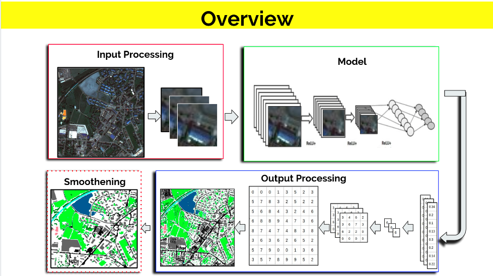
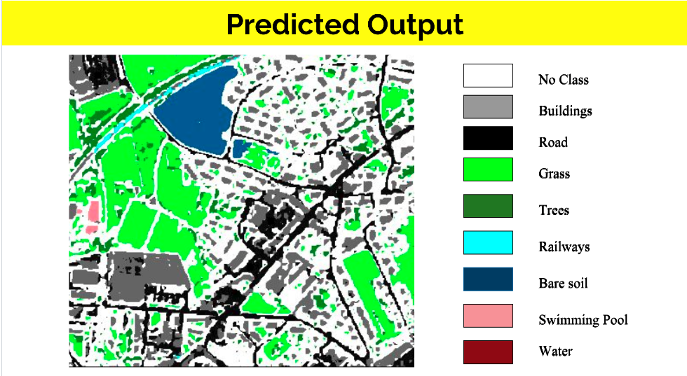

# Satellite Image Classfication for eye in sky competion, Inter IIT Tech meet 2019, IIT BOMBAY 

Task was to do train a model for satellite image classification of various class using just 14 images.
1) output_images: output from our model
2) Report/Report.pdf
3) ReadMe.md
4) Code/modelBest.h5 : best model saved till date(results shown in report)
5) In Code, Code_python as the Source Code in different formats: .html, .ipynb, .py

